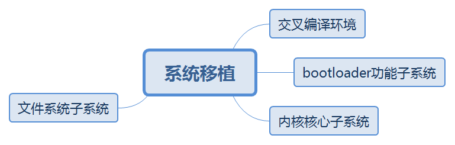
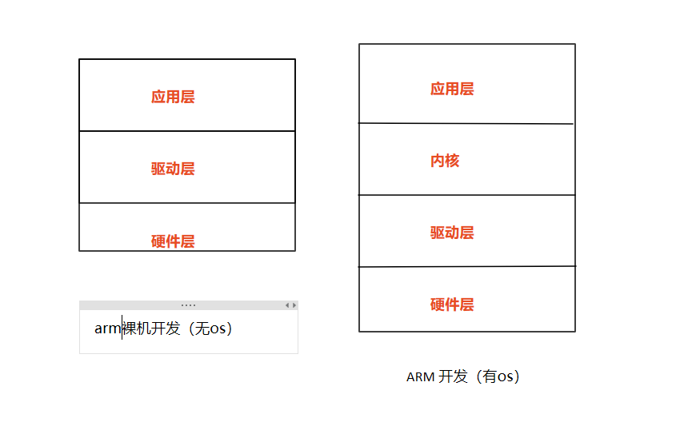

# 初识系统移植
Linux系统移植萌新，因为报名参加了暑假2020的openuler社区的项目(不知道，能过吗？)，所以学习相应的系统移植知识。

## 初识系统移植

Linux系统移植大概可以分为以下四个部分，其中交叉编译环境，bootloader功能子系统，一般由芯片公司提供。

## arm系统框架图
arm开发简单的框架图，如下图所示：

在将openEuler移植到其他的开发版时，要对相应的驱动层进行适配，使能相应的硬件。

## 移植要点

- 搭建交叉编译开发环境
- bootloader的选择和移植
- 内核的配置，编译，移植和调试
- 根文件系统的制作

## 学习方法
先整体后局部，层层推进
如何编译 -> 如何添加命令或功能 -> 如何定义自己的开发版

## 移植的基本方法
- 确定目标机，主机的连接方式
- 安装交叉编译器
- 搭建主机，目标机数据传递通道
- 编译三大子系统
- 烧写测试

