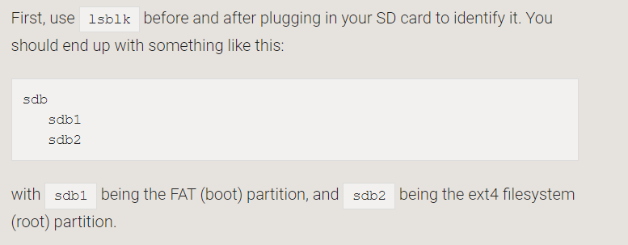
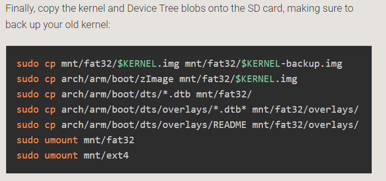

# 内核启动的基本知识
## 基本知识
嵌入式内核启动步骤如下：
> 上电 -> bootloader -> Linux内核 -> 挂载根文件系统 ->应用程序

与windows进行类比加深理解：

```flow
#赋值语句
st=>start: windows上电
e=>end: 运行运用程序
op1=>operation: BIOS
op2=>operation: 引导操作系统
op3=>operation: 识别硬盘
#连接语句
st->op1->op2->op3->e
```

## 内核移植的文件
可以打开树莓派的官网，在Linux中看到我们要进行内核移植的话，要移植那些文件。
### 安装模块
```
mkdir modules_install		#创建一个文件夹用于存放生成的文件

sudo env PATH=$PATH make ARCH=arm CROSS_COMPILE=arm-linux-gnueabihf- INSTALL_MOD_PATH= ./modules_install   #编译生成内核驱动

make dtbs_install ARCH=arm CROSS_COMPILE=arm-linux-gnueabihf- INSTALL_DTBS_PATH=./modules_install 	 #编译生成设备树
```
识别内存卡，图片如下：



复制内存与设备树



总体来说就是将**modules_install**里面的文件复制到boot分区

## 总结
只是简单的跑了，树莓派官网内核移植的demo，了解官网树莓派移植的一些过程。没有涉及更复杂的一些知识，如`kconfig`,`kbulid`,`makefile`都没有涉及。