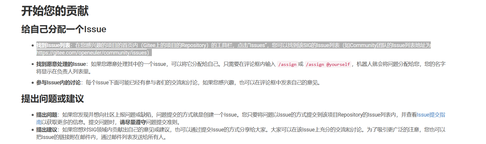
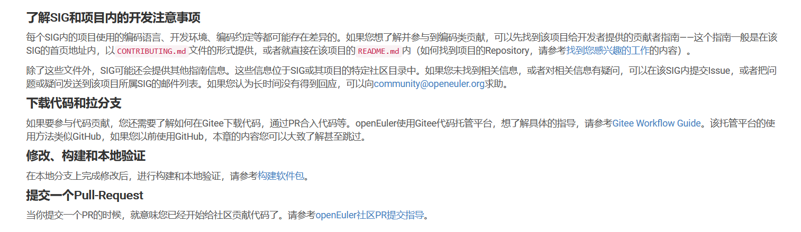

[toc]
## 在Euler贡献之前
今天收到了导师的邮件，主要是讲项目开发之前的工作。总结起来就是如下：

- 下载安装 Slack，加入相应的team
- 熟悉 openEuler 基本情况，可浏览官网
- 注册 gitee 账号，并根据 openEuler “社区贡献”要求签署 CLA
- 了解相关社区相应的SIG情况
- 了解 openEuler 贡献代码等相关规则

## 熟悉openEuler 情况

slack需找到对应的组织后加入，在开源社区经常使用slack进行办公。

[访问官网](https://openeuler.org/zh/)

[开发者贡献须知](https://openeuler.org/zh/developer.html)

[社区列表](https://openeuler.org/zh/community/mails.html)

[sig项目组](https://openeuler.org/zh/sig.html)

## 开始你的贡献

- 找到Issue列表
- 找到愿意处理的Issue
- 参与Issue内的讨论

## 开始提PR

- 下载代码和拉分支 
- 修改、构建和本地验证
- 提交一个Pull-Request 

[构建软件包](https://gitee.com/openeuler/community/blob/master/zh/contributors/package-install.md),不太明白其意思，待仔细了解

[openEuler社区PR提交指导](https://gitee.com/openeuler/community/blob/master/zh/contributors/pull-request.md),重点了解

## 检视代码 

- 贡献背后的想法是否合理
- 贡献的架构是否正确
- 贡献是否完善

## 总结

零零碎碎，仔细看完了Euler的贡献规则，及其他的一些相关事宜。更具体的等贡献时，具体理解与揣摩！！