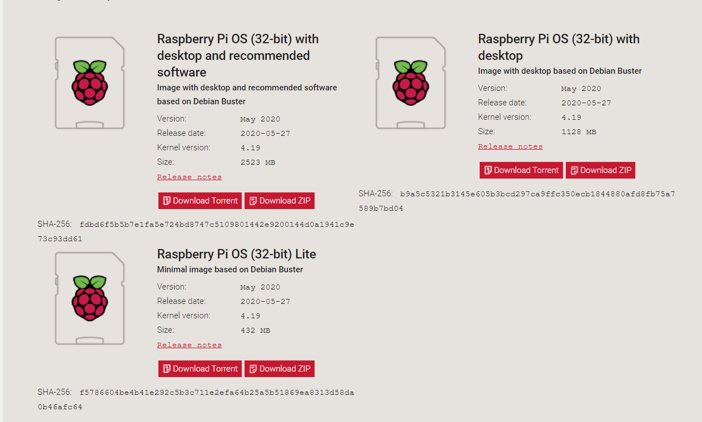
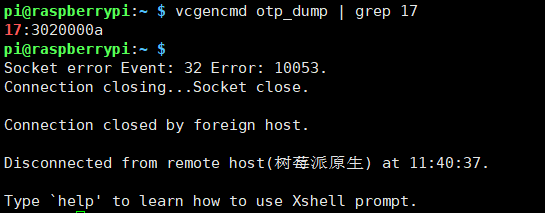

# 树莓派3b官方UFIU启动

## 前言
今天测试了一下官方树莓派，原生的UFIU启动是什么样的。主要是镜像的下载/刷写/测试。由于没有搭建好U-boot和，qemu的环境，拿了三张内存卡分别烧写不同的镜像。

## 镜像

[树莓派官网](https://www.raspberrypi.org/downloads/raspberry-pi-os/)

详细信息见下图：



烧写系统工具
`Win32DiskImager`

格式化工具
`SD Formatter 4.0 绿色中文版`

远程连接工具
`XShell`,由于树莓派默认将ssh关闭，所以我们要在boot目录下新建一个**SSH**的文件。由于SSH连接要联网，我们可以再boot目录新建文件`wpa_supplicant.conf`

内容如下：
```
country=CN
ctrl_interface=DIR=/var/run/wpa_supplicant GROUP=netdev
update_config=1

network={
    ssid="WIFI账号"
    psk="WIFI密码"
    priority=1
}
```

## 4B之前的树莓派启动流程

4B之前的版本的启动流程，主要分为四个阶段：

- GPU读取芯片上一个ROM的内容并执行
- ROM中的程序挂载SD卡并加载第一个FAT分区上的bootcode.bin
- bootcode.bin从FAT分区加载start.elf
- start.elf从FAT分区加载kernel.img，然后唤醒CPU,CPU开始执行   kernel.img

设置树莓派3b的u盘启动

>echo program_usb_boot_mode=1 | sudo tee -a /boot/config.txt

也可以直接在boot里面设置，`config.txt`末尾加入`program_usb_boot_mode=1`

使用`vcgencmd otp_dump | grep 17` 检测相应的寄存器。如果输出如下图，即可完成设置(之前是`17:1020000a`)



之后，即可用U盘写系统，用用U盘登录
<font color =red size =5>注意</font>

- 该写入寄存器操作不可逆，简单来说就是系统以后会检测sd卡，然后在检测u盘启动！
- u盘启动，耗时间（个人感觉30s），屏幕会出现以下信息，无信号，黄屏，初始化等操作，请耐心等待！
- 
## 参考文献

[树莓派官网](https://www.raspberrypi.org/downloads/raspberry-pi-os/)

[Raspberry Pi boot modes](https://www.raspberrypi.org/documentation/hardware/raspberrypi/bootmodes/)

[树莓派入门（四） -从U盘启动树莓派](https://blog.csdn.net/zhshh123/article/details/85065035)

[树莓派4B设置USB启动](https://blog.csdn.net/nanhantianyi/article/details/106542616?utm_medium=distribute.pc_relevant.none-task-blog-BlogCommendFromMachineLearnPai2-5.nonecase&depth_1-utm_source=distribute.pc_relevant.none-task-blog-BlogCommendFromMachineLearnPai2-5.nonecase)