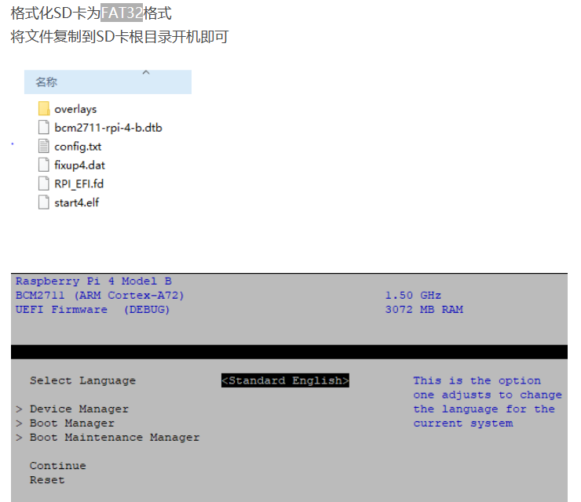
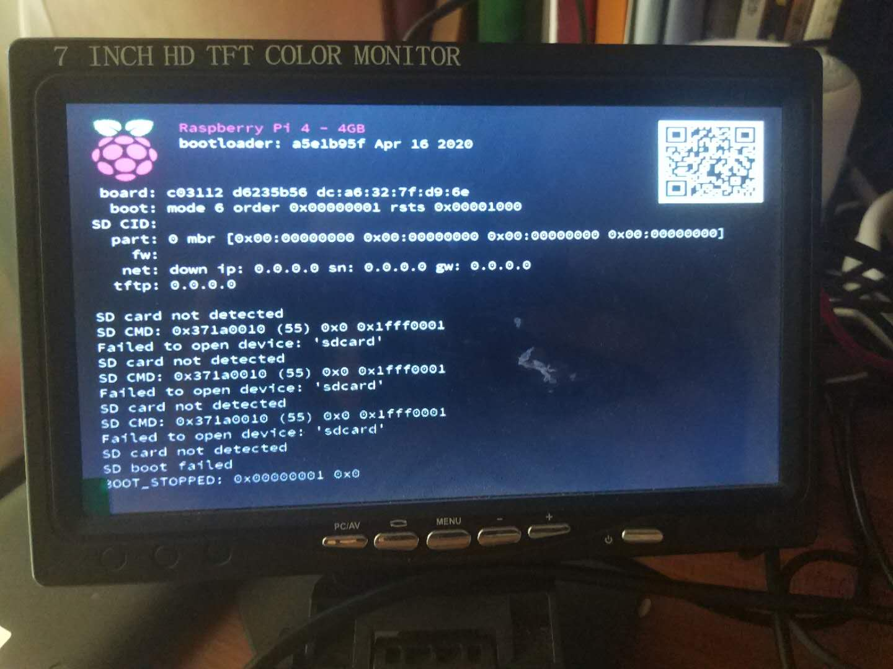

# 树莓派4B官方U盘启动

## 前言

发现自己设计思路错了，错将U盘启动等价于UEFI启动了，直到看到树莓派UEFI结构应该如下，萌新流泪！！




## 更换源并更新软件
```
sudo nano /etc/apt/sources.list //编辑sources.list，在官方的地址前添加#
deb http://mirrors.ustc.edu.cn/raspbian/raspbian/ buster main contrib non-free rpi
sudo nano /etc/apt/sources.list.d/raspi.list //编辑raspi.list，在官方的地址前添加#
deb http://mirrors.ustc.edu.cn/archive.raspberrypi.org/debian/ buster main
sudo apt-get update && sudo apt-get dist-upgrade //更新
```

nano编辑器，`ctrl + o`保存，`ctrl +x `退出

## 更新eeprom

然后编辑 `naoo /etc/default/rpi-eeprom-update`文件，把内容改为`FIRMWARE_RELEASE_STATUS="beta"`，现在稳定的eeproom `2020-04-16`版本，需要更换到大于`2020-05-15`的版本才能支持u盘启动

查看版本信息`vcgencmd bootloader_version`,

下图是没有插SD卡与U盘的界面



设置默认升级固件设置`rpi-eeprom-update -d -a`,重启。树莓派4B即开启了u盘启动的设置。

更多设置详情可以看[官方链接](https://www.raspberrypi.org/documentation/hardware/raspberrypi/bcm2711_bootloader_config.md)，这里使用默认设置

```
0x0-无（以错误模式停止）
0x1-SD卡
0x2-网络
0x3-USB设备启动usbboot-仅计算模块。
0x4-USB大容量存储启动
0xf-重新启动（循环）-从第一个引导顺序字段重新开始。
```

## 更新启动介质

eeprom升级后要配合最新的BootLoader才能实现USB启动，需要到[官方固件库下载](https://github.com/raspberrypi/firmware/tree/master/boot),下载完后

将boot里面的的`fixup*.dat`和`star*.elf`文件(共16个)拷贝到U盘覆盖原文件。注意前往不要boot里面的东西全部整体覆盖，会出现键盘没有办法用的现象！！！

之后，将u盘插入，重启，等待一阵子既可以用u盘启动镜像了。

## 参考文献

[树莓派4B设置USB启动](https://blog.csdn.net/nanhantianyi/article/details/106542616)

[树莓派4B：USB移动硬盘盒启动（beta版）](https://blog.csdn.net/ki1381/article/details/106412858?utm_medium=distribute.pc_relevant.none-task-blog-BlogCommendFromMachineLearnPai2-1.nonecase&depth_1-utm_source=distribute.pc_relevant.none-task-blog-BlogCommendFromMachineLearnPai2-1.nonecase)

[Pi 4 Bootloader配置](https://www.raspberrypi.org/documentation/hardware/raspberrypi/bcm2711_bootloader_config.md)