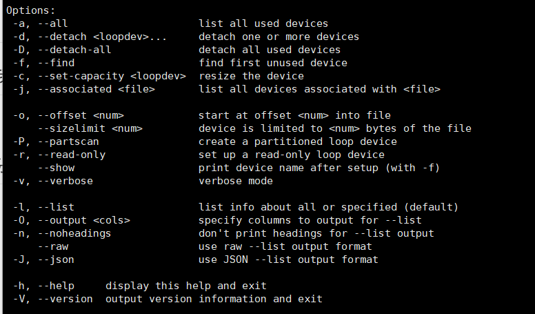
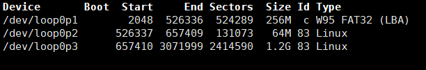

#  Linux挂载镜像的一些命令
在Linux中，可以用`losetup`命令来设置无分区空白镜像到loop设备上，用`kpartx` 来kpartx映射分区的镜像到loop设备上。

之后通过`mount`命令将loop设备与系统文件相链接

## losetup 设置循环设备
该方式无法创造分区，可以用`parted`命令创造分区表
推荐直接用`losetup -h`，查询相应指令



常用参数
-   -f 查看可用loop设备
-   -d 卸除设备

实例

1.创建空的磁盘镜像文件，这里创建一个1.44M的软盘

>dd if=/dev/zero of=floppy.img bs=512 count=2880

2.使用 losetup将磁盘镜像文件虚拟成快设备

>losetup /dev/loop1 floppy.img

3.挂载块设备

> mount /dev/loop0 /tmp

经过上面的三步之后，我们就可以通过/tmp目录，像访问真实快设备一样来访问磁盘镜像文件floppy.img。

4.卸载loop设备

>umount /tmp
>losetup -d /dev/loop1

## parted创建分区表

> parted debian.img mktable msdos

详细命令可以参考[parted命令详解](https://www.cnblogs.com/machangwei-8/p/10353690.html)
 
## fdisk 维护分区表
该命令是交互式命令，熟悉后可以直接用`cat`一行写入所有信息。

常用参数
- m ：显示菜单和帮助信息
- d ：删除分区
- n ：新建分区
- p ：显示分区信息
- w ：保存修改

```
cat <<EOF | fdisk openEuler_raspi.img
n
p
1
2048
526336
n
p
2
526337
657409
n
p
3
657410
3071999
w
EOF
```
使用`fdisk -l`后显示如下：



计算如下:
第一分区是256MB所以526336-2048=256x2048，第二分区64MB所以657409-526337=64x2048依此类推。

## kpartx映射分区
常用参数
- -a指定去添加哪个映像文件(add)
- -v是指挂到loop设备(verbose)，
- -d就是delete的意思

如
>kpartx -av openEuler_raspi.img /dev/loop0

分区将映射在`/dev/loop0`下。