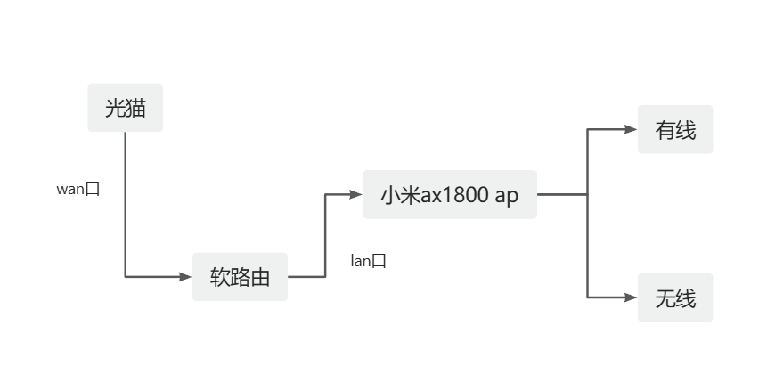

# 路由器分配_20241102
## 目标
整理家里路由器分配，保证各个电子产品功能正常。

涉及电子产品
-  n100 小主机，16gb+512gb
    - pve,负责分配硬件资源,挂载不同的系统
    - openwrt,各种科学服务
    - ikua,确保家里不断网
- 小米ax3600 主路由,AP
- 黑群晖nas，6t,资料备份
- meta quest3s ，一定要外网链接
- mac bookair ，无特殊需求
- pc 笔记本，无特殊需求
- ipad，无特殊需求
- iPhone 15， 无特殊需求
- 红米note8，待翻墙，无特殊要求

## 设计
- 保证设备不需要安装代理,能够方便的访问外网
- 尽量维持现阶段ip不改变
- 稳定好用

### 软路由当主路由

