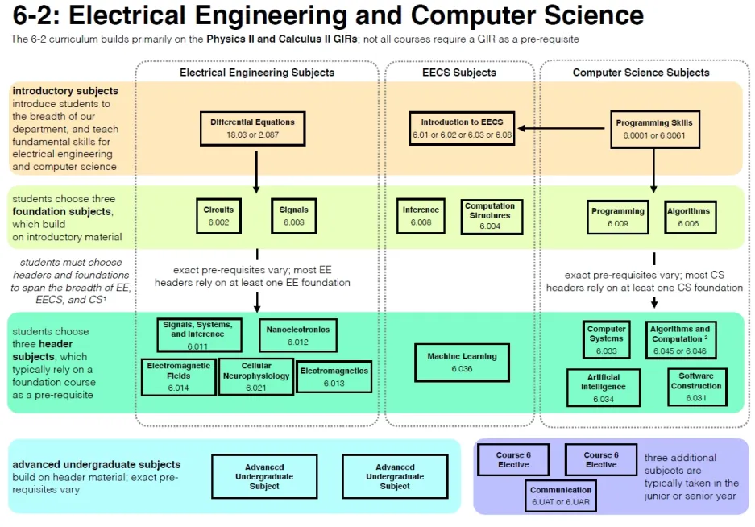
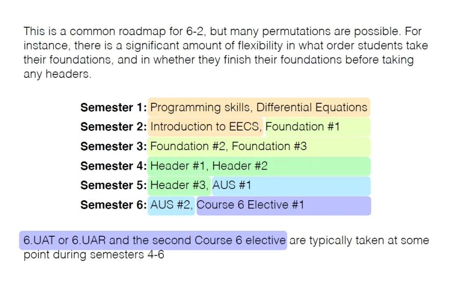

# MIT EECS 课程学习(6-2)_20250304
## 课程大纲说明

## 参考链接

https://www.eecs.mit.edu/academics/undergraduate-programs/curriculum/6-2-electrical-engineering-and-computer-science/

https://web.mit.edu/education/

https://ocw.mit.edu/
