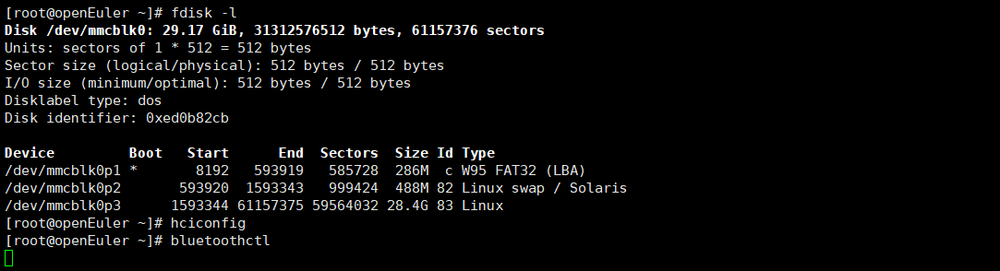
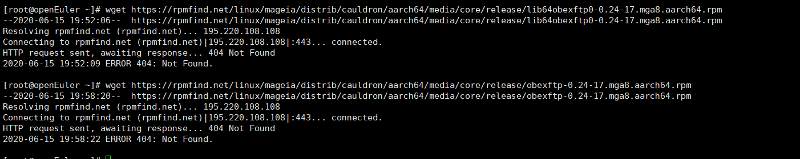
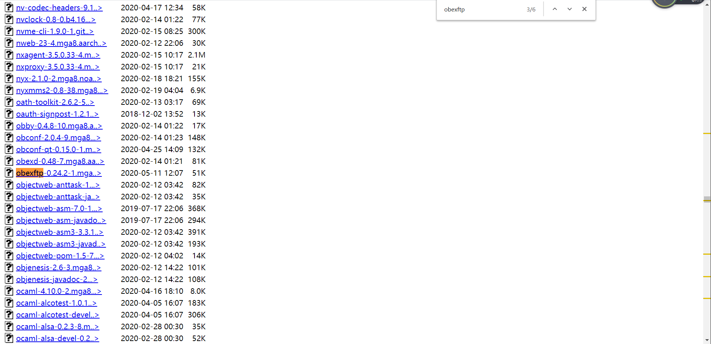
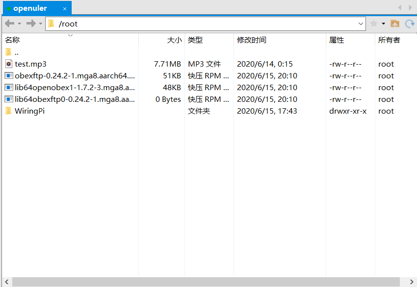
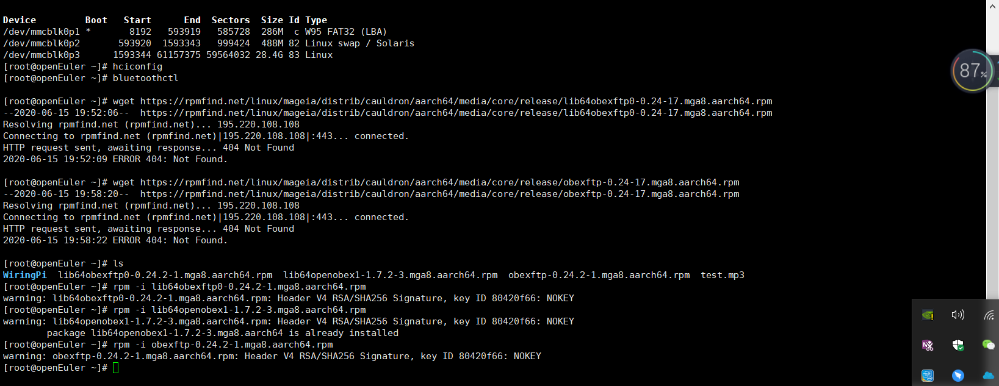

[toc]
# 前言
该部分是自己安装树莓派3b的测试与总结，具体的安装过程，可以参考

官方文档。

[ 刷写镜像](https://gitee.com/openeuler/raspberrypi/blob/master/documents/%E5%88%B7%E5%86%99%E9%95%9C%E5%83%8F.md)

[树莓派使用](https://gitee.com/openeuler/raspberrypi/blob/master/documents/%E6%A0%91%E8%8E%93%E6%B4%BE%E4%BD%BF%E7%94%A8.md)
## 测试中的一些疑惑与问题
### 无法输出蓝牙设备信息及进入相应进程

刚开始的时候还是可以用`bluetoothctl `进入交互式界面的，后面不知怎么了，一直挂起在该进程。**待查询资料及阅读源码理解**。

### wegt 链接出现404问题
在下载obexftp相应链接时发现出现了404的错，

解决办法，在给的[下载地址](https://rpmfind.net/linux/mageia/distrib/cauldron/aarch64/media/core/release/)

用`ctrl + f` 搜索分别 `lib64obexftp0` ,`lib64openobex1`,`obexftp`,完成对应的下载。如图所示

之后可以使用`xfpt`软件,将下载的文件通过ssh发给树莓派。如下图所示。

之后使用使用`ls`命令查看文件名称，在分别用`rpm -i xxx` 完成对应的安装即可。

## 总结
该文档只是跑了一下官方的基本demo，内核交叉编译，制作镜像等待项目通过后补充。
