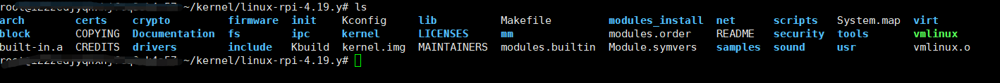

# 编译树莓派内核
## 前言
由于openEuler已经在树莓派3/3b+/4上进行了相应的移植,本人的工作也是对openEuler-树莓派内核启动方式的替换，所以进行相应的学习，整理。
> 测试环境 华为云esc 2v|8g
## 对原生的树莓派内核源码进行编译
在树莓派官网下找到[Linux](https://www.raspberrypi.org/documentation/linux/)的相关文档，选择building。既可以看到相关操作。官方提供了直接编译与交叉编译两种方式。推荐使用**交叉编译**。下面介绍交叉编译的工作步骤
### 预处理
- 安装依赖
> sudo apt install git bc bison flex libssl-dev make libc6-dev libncurses5-dev

- 下载工具链到 ~/tools文件夹
>git clone https://github.com/raspberrypi/tools ~/tools

- 使能相应工具设置
> echo PATH=\$PATH:~/tools/arm-bcm2708/arm-linux-gnueabihf/bin >> ~/.bashrc

- 更新环境
> source ~/.bashrc

- 下载内核源码，选择最新分支

>git clone --depth=1 https://github.com/raspberrypi/linux

<font color = red size = 5>Notes</font>
由于该文件较大，GitHub上下载较慢，可以zip下载到本地，在上传到服务器进行编译。
注意，配置时相应的文件夹目录

### 编译内核
- 生成.config配置文件
```
cd linux 
KERNEL=kernel7
make ARCH=arm CROSS_COMPILE=arm-linux-gnueabihf- bcm2709_defconfig
```

- 生成内核压缩镜像
> make - j n ARCH=arm CROSS_COMPILE=arm-linux-gnueabihf- zImage modules dtbs

<font color = red size = 5>Notes</font>
可以用-j n 进行并行编译配置，官方推荐n为1.5倍的内核数

- 创建一个文件夹用于存放生成的文件
>mkdir modules_install	

- 编译生成内核驱动
>make modules_install ARCH=arm CROSS_COMPILE=arm-linux-gnueabihf-INSTALL_MOD_PATH=./modules_install  

- 编译生成设备树
>make dtbs_install ARCH=arm CROSS_COMPILE=arm-linux-gnueabihf- INSTALL_DTBS_PATH=./modules_install

- 转换成可启动的镜像

> ./scripts/mkknlimg ./arch/arm/boot/zImage ./kernel.img	

最后结果kernel目录如图所示



## uboot的相关知识
### 常用命令
|  命令   | 解释  |
|  ----  | ----  |
| `？`| 相当与help |
|`print` | 打印环境变量|
| `setenv`| 设置环境变量|
|`saveenv`|保存环境变量|
|`nand`|NAND sub-system|
|`go`|start application at address 'addr|

推荐直接用`?`，进行相关命令的查询

### uboot启动阶段

阶段1:汇编阶段

	1> 构建异常向量表
	
	2> 切换到svc模式,禁止看门狗
	
	3> 关闭MMU和icache
	
	4> 清除bss段,完成uboot代码到内存的自搬移
	
	
	5> 初始化栈
阶段2:C语言阶段

	1> 完成对gd(global data)结构体的初始化
	
	2> 完成大部分硬件的初始化(串口\网卡\flash\电源\使能中断)
	
	3> 根据用户命令或者预设命令,切换进入自启动模式或交互模式
	
	4> 执行bootcmd中的命令参数
	
	5> 将bootargs中的参数传递给内核
	

### 内核源码目录
|  文件/目录   | 解释  |  文件/目录   | 解释  |
|  ----  | ----  | ---- | --- |
| arch		|架构		|	block			| 块	     |
| certs		|证书		|	crypto			| 加解密子系统	|
| Documentation	|文档	|	drivers		| 驱动   |
| firmware	|固件		|	fs 		| 文件系统	|
| include	|头文件		|	init			| 初始化	|
| ipc		|进程		|	kernel			| 内核		|
| lib		|库		|	LICENSES		| 许可证	|
| mm		|内存		|
| net 		|网络		|	samples			| 案例		|
| scripts	|脚本		|	security		| 安全		|
| sound 	|声卡		|	tools			| 工具		|
| usr		|用户		|	virt			| 虚拟机	|

## 参考资料

[树莓派官方文档](https://www.raspberrypi.org/documentation/linux/)

[编译树莓派Linux内核](https://www.pypyn.com/archives/category/raspberrypi/page/2/)
