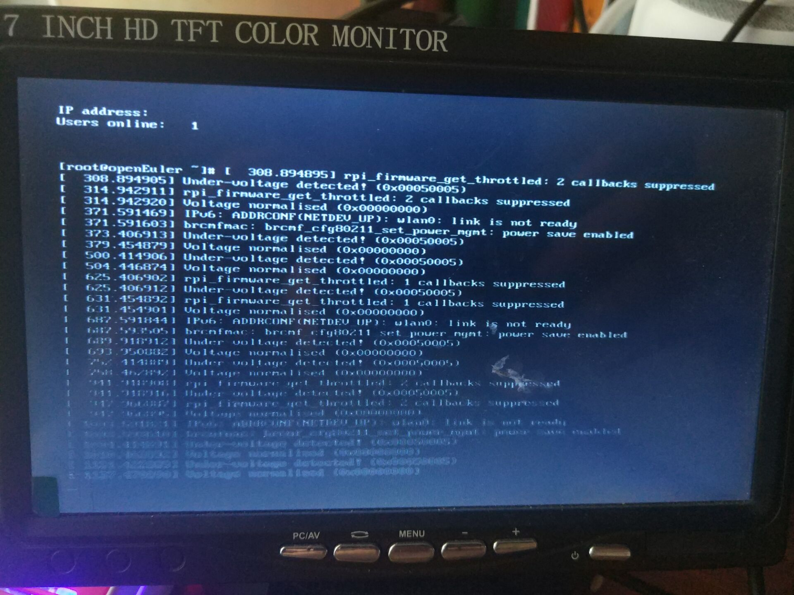

# 交叉编译Euler镜像

## 前言

上一周溜到外地去参加比赛，相应的进度有些拖拉，但是问题不大，我要作的最终工作就是UEFI启动。

即上电后，U-boot启动内核这部分。

当然，由于是内核移植的萌新，要加油学习啊！！！！

## 交叉编译内核


[交叉编译内核](https://gitee.com/openeuler/raspberrypi/blob/master/documents/%E4%BA%A4%E5%8F%89%E7%BC%96%E8%AF%91%E5%86%85%E6%A0%B8.md)

基本上是按照文档操作的，但萌新有些注意事项。

### 内核源码的下载

`git clone git@gitee.com:openeuler/raspberrypi-kernel.git`

由于参考文献给的是`SSH`的下载连接，所以先要将本机的公钥上传到gitee上。

查看本机公钥` cat ~/.ssh/id_rsa.pub`

具体可以参见[查看本机ssh公钥，生成公钥](https://blog.csdn.net/shog808/article/details/76563136)

### 载入默认设置失败

在进行到`make openeuler-raspi_defconfig`，出现了包没有安装的错误。

参考[Make menuconfig的遇到的错误总结](https://www.cnblogs.com/tod-reg20130101/articles/9280792.html)

安装相应报错的包即可。

```

apt-get install bison -y
sudo apt-get install flex
```

## 内核测试

使用树莓派真机进行测试，当然也可以用qemu搭建仿真环境(该部分待了解)

- 将内核模块放进rootfs根文件系统

> cp -r ${WORKDIR}/output/lib/modules ${rootfs}/lib/

该部分有些不明白，因为modules下面是个`4.19.90-g7d1ed3a`的文件夹与内存卡中`{rootfs}/lib/`感觉不符合，待仔细了解补充

- 将内核放进引导

>cp ${WORKDIR}/output/Image ${boot}/kernel8.img

该部分有些不明白，直接复制？不需要相应的脚本转换？待仔细了解补充

验证部分，7-12号没有成功，待仔细了解补充！！！！

后期还需补充u盘设备挂载的一些知识

[ linux命令-挂载命令](https://www.cnblogs.com/hjnzs/p/11943982.html)

## 镜像问题

在linux下推荐使用`Etcher软件`烧写镜像！！！

将官方提供镜像烧进，树莓派4b后树莓派命令行交互工具一直在报错，这是在树莓派3b没有的，待仔细了解。

