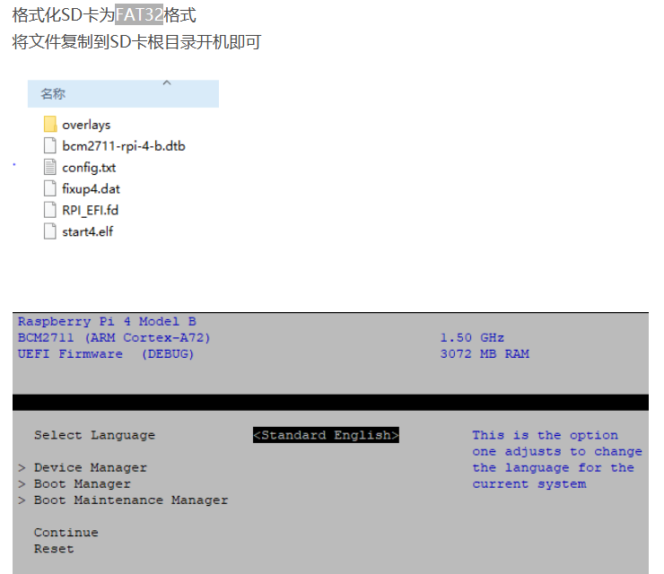
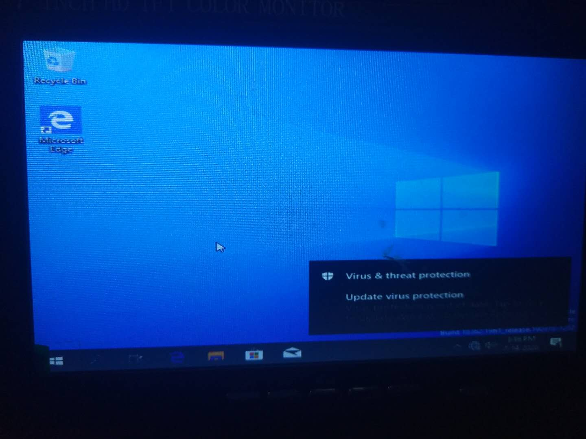
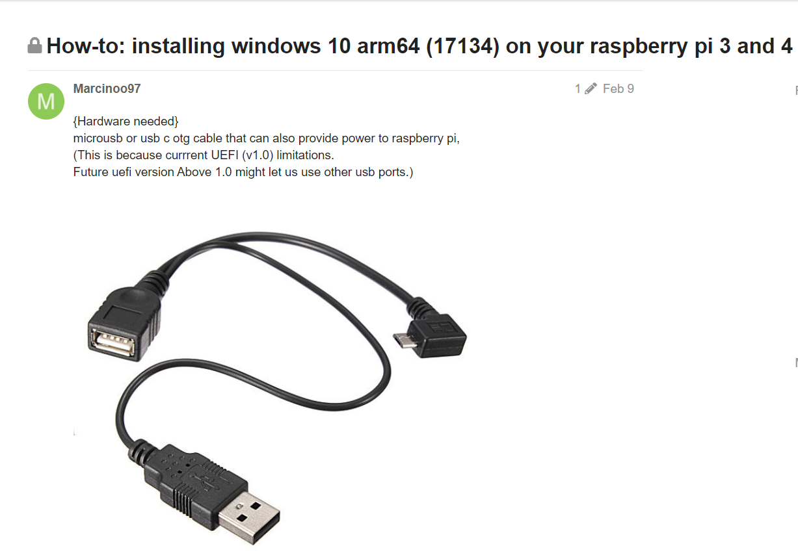

# 初识树莓派UEFI启动

## UEFI的样子

到[树莓派官方固件库](https://github.com/pftf/RPi4/tags)，下载最新固件到SD卡内，插入树莓派4B，样子应如下：

选择Boot Maintenance Manager → Boot Options → Change Boot Order进入后回车，按键盘+号或-号将SD/MMC on Arasan SDHCI 用“+”键移到最上边，保存重启。（调整启动顺序）

具体该界面的功能，待了解补充

## 初识UEFI,安装win10

### 树莓派3b安装win10

微软官方提供[Windows 10 IoT](https://docs.microsoft.com/zh-cn/windows/iot-core/downloads),下载安装即可，更多详细资料可以看，[树莓派安装及简单使用windows 10 iot](https://raspberrypi.club/488.html)。
我用树莓派3b 试了下该方法，一直没有成功，最后用[wor提供的工具](https://www.worproject.ml/downloads),安装成功，[油管视频讲解](https://www.youtube.com/watch?v=cYcETDnoCEQ)

界面如下：

### 树莓派4b安装win10

也用[wor提供的工具](https://www.worproject.ml/downloads)进行了树莓派4b镜像的制作，但是发现在安装进行到语言设置的时候，键盘/鼠标失效，应该是对应的驱动问题。

查看[官方讨论区](https://discourse.pi64.win/t/how-to-installing-windows-10-arm64-17134-on-your-raspberry-pi-3-and-4/488/134)，官方推荐解决办法是在电源供电的type-c的地方，搞个转接口用来支持键盘/鼠标。

## 参考资料

[树莓派4b装Windows10 ARM详细步骤是什么？](https://www.zhihu.com/question/376983594/answer/1105179310)