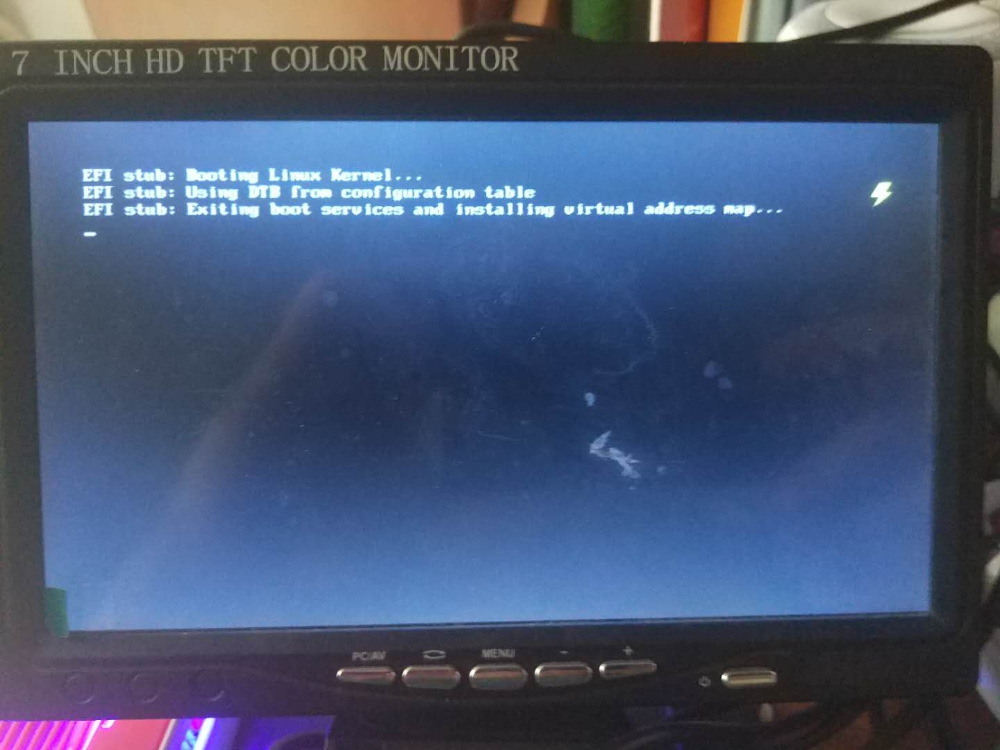

# 第二三周总结
## 前言

最近干的有些气馁，主要是在设计的初期将UEFI启动看成了U盘启动，然后一直在测试相关的知识，直到一周前才发现UEFI启动的样子。

## 相应工作

完成openEuler的镜像构建，[2020-07-13-openEuler镜像的构建](https://isrc.iscas.ac.cn/gitlab/summer2020/students/proj-2021102/-/blob/master/docs/2020-07-13-openEuler%E9%95%9C%E5%83%8F%E7%9A%84%E6%9E%84%E5%BB%BA.md),当然根文件系统本地没有构建成功，移植了镜像的根文件系统。相关功能待测测试。

(待补充总结)树莓派4B刷了UEFI的固件，然后去启动[openEuler的原始镜像](https://repo.openeuler.org/openEuler-20.03-LTS/ISO/aarch64/),一直卡在如下界面：

## 下一周工作

仿照[2020-07-16-树莓派4B构建debian镜像UEFI启动](https://isrc.iscas.ac.cn/gitlab/summer2020/students/proj-2021102/-/blob/master/docs/2020-07-16-%E6%A0%91%E8%8E%93%E6%B4%BE4B%E6%9E%84%E5%BB%BAdebian%E9%95%9C%E5%83%8FUEFI%E5%90%AF%E5%8A%A8.md)的博客进行openEuler的移植。

初步思路(问了大佬，，)是grub启动UEFI固件，grub.cfg里面编辑cmdline启动信息。可以参考openSUSE的相应实现。

